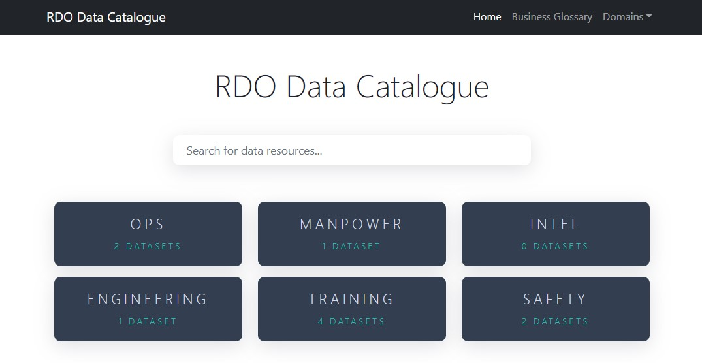
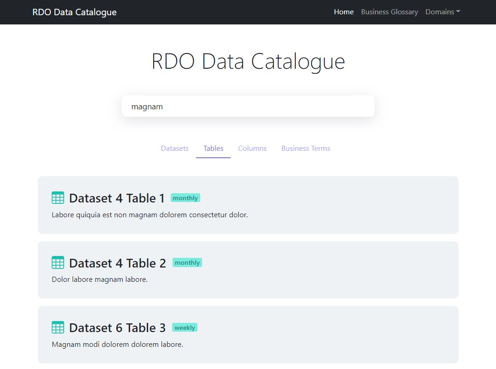
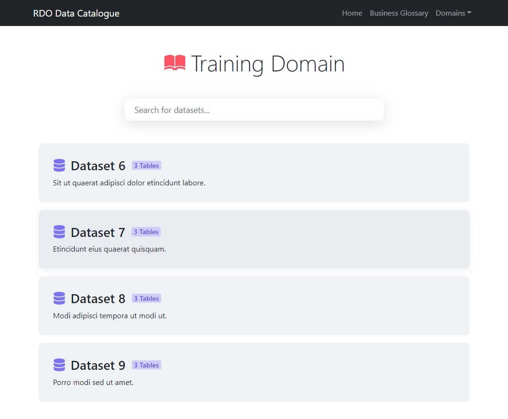
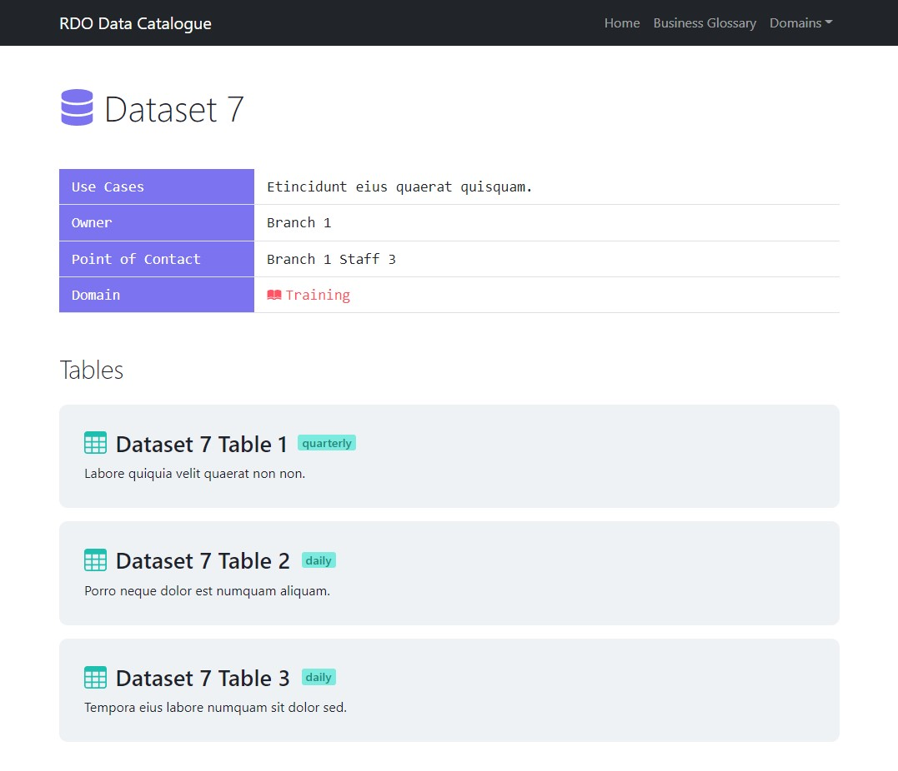
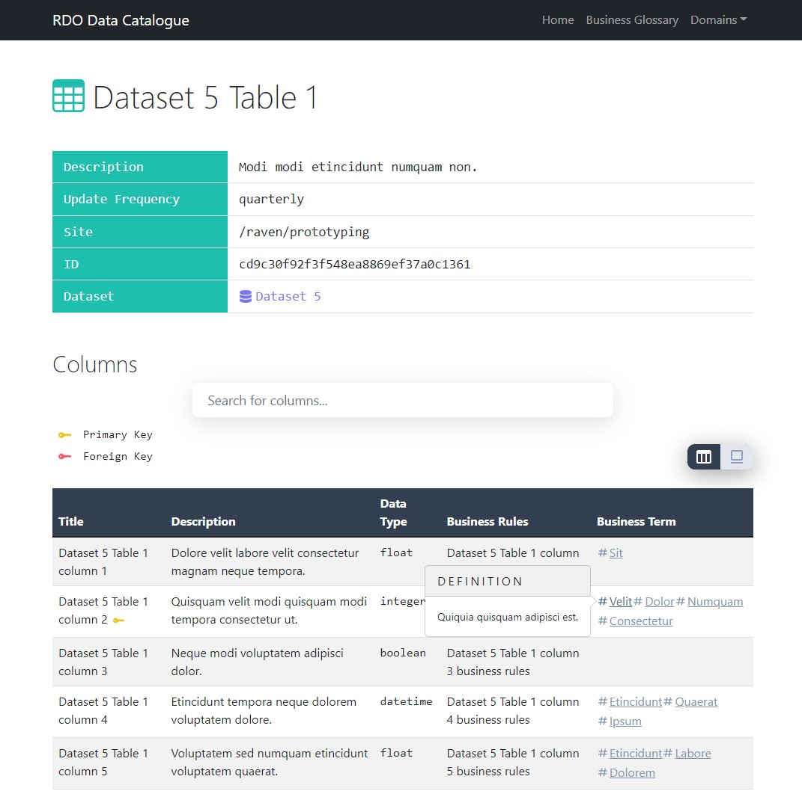
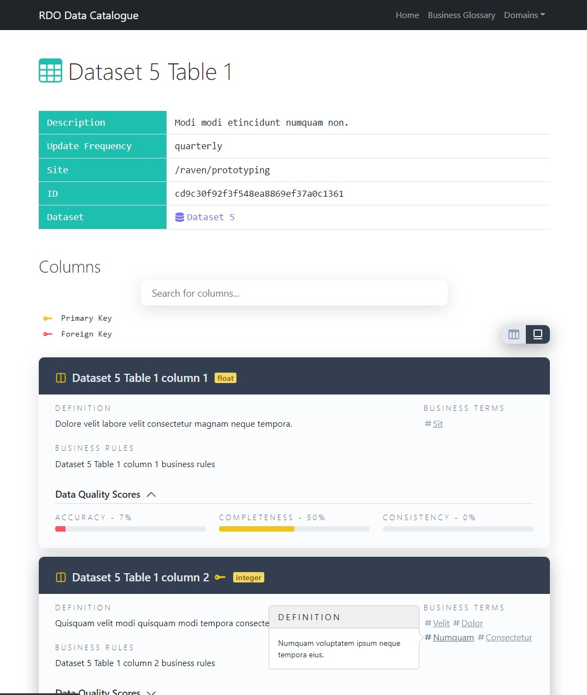
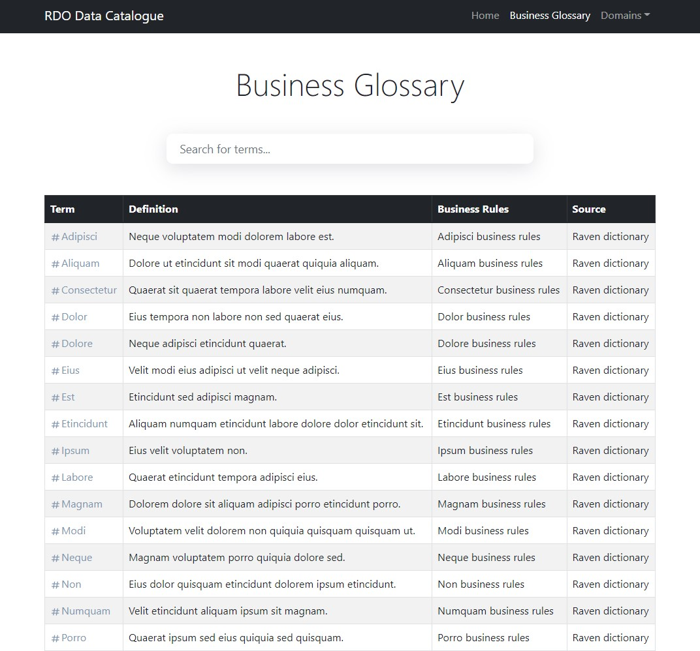
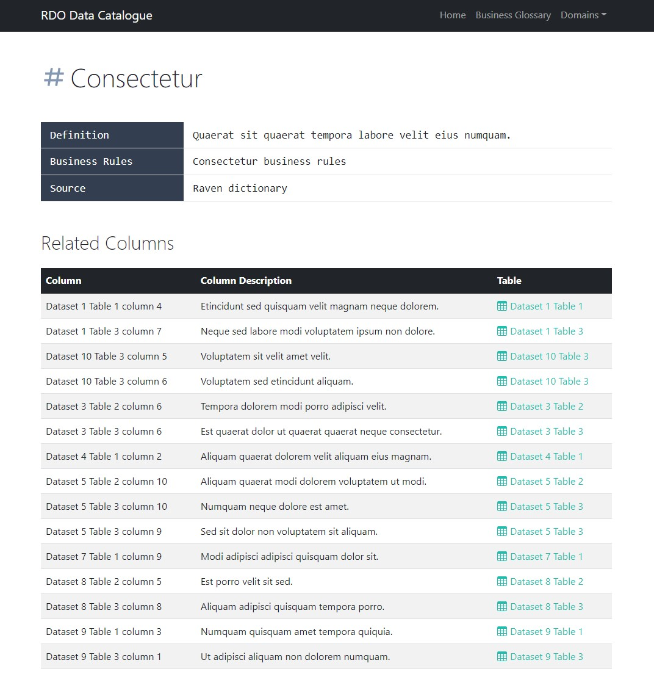

# Data Catalogue
RDO's Stack 2.0 solution for a data catalogue.

  
  
  

## Key Elements
1. Datasets - grouped by Data Domains
2. Tables - grouped by Datasets
3. Columns - grouped by Tables
4. Business Terms

#### Home

#### Home - Search
Users can run a search on the home page to find any resource: dataset/table/column/term.

#### Domain View
The domain view lists all datasets tagged under that domain.

#### Dataset View
The dataset view lists all tables that are part of that dataset.

#### Table View: Table
The table view lists all columns with two view options: (1) tables and (2) cards.

#### Table View: Cards

#### Business Glossary
The business glossary view lists all terms. It allows users to run searches to filter the list in real-time.

#### Business Terms
The business term view displays details about the term, and lists all columns where the given term was tagged.

