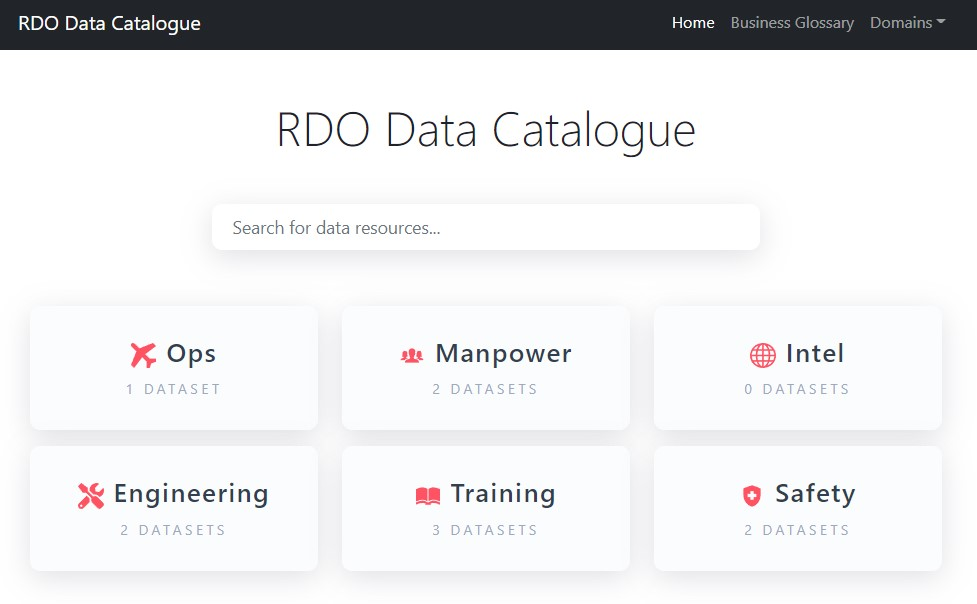

# Data Catalogue
RDO's Stack 2.0 solution for a data catalogue. Check out a live demo with no data [here](https://chrischow.github.io/rdo-data-platform/data-catalogue/prod-build/index.html).


<p>
  
  
  
</p>

## Key Elements
1. Datasets - grouped by Data Domains
2. Tables - grouped by Datasets
3. Columns - grouped by Tables
4. Business Terms

```mermaid
erDiagram
  Dataset ||--|{ Table
  Table ||--|{ Column
  Business Term ||--|{ Column
  Dataset {
    int Id PK
    string Title
    string useCases
    string owner
    string pointOfContact
    string dataDomain
  }
  Table {
    int Id PK
    string Title
    string tableDescription
    string updateFrequency
    int parentDataset FK "Dataset"
    string site
    string guid0
  }
  Column {
    int Id PK
    string Title
    string columnDescription
    string dataType
    string businessRules
    int parentTable FK "Table"
    bool isPrimaryKey
    bool isForeignKey
    string codeTable "SharePoint GUID of code table"
    string relatedFactTable "SharePoint GUID of fact table"
    string businessTerm FK "Multi-valued lookup to business terms"
  }
  Business Term {
    int Id PK
    string Title
    string definition
    string businessRules
    string Source
  }
```

#### Home




#### Home - Search
Users can run a search on the home page to find any resource: dataset/table/column/term.


#### Domain View
The domain view lists all datasets tagged under that domain.


#### Dataset View
The dataset view lists all tables that are part of that dataset.


#### Table View: Table
The table view lists all columns with two view options: (1) tables and (2) cards.


#### Table View: Cards


#### Business Glossary
The business glossary view lists all terms. It allows users to run searches to filter the list in real-time.


#### Business Terms
The business term view displays details about the term, and lists all columns where the given term was tagged.

