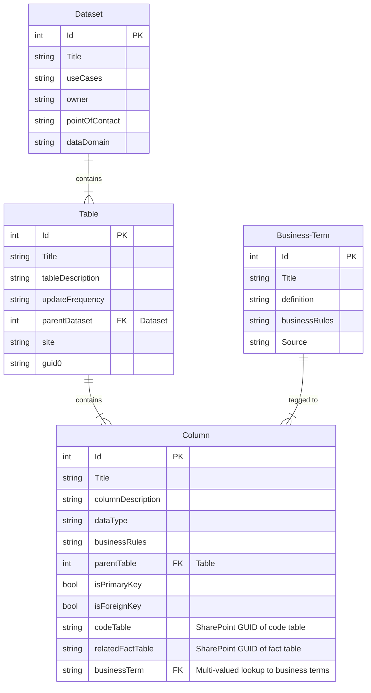
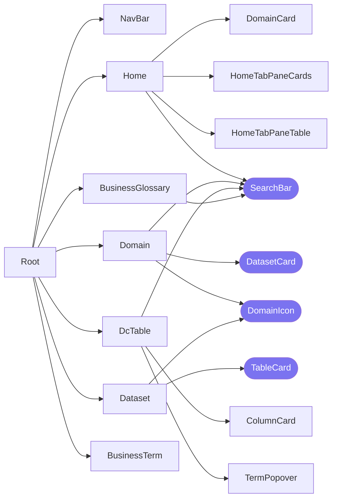

# Developer Guide
This README contains details of the RDO Data Catalogue's implementation.

## Data
The main entities are:

1. Datasets - grouped by Data Domains
2. Tables - grouped by Datasets
3. Columns - grouped by Tables
4. Business Terms

## Main Libraries
| Library | Purpose |
| :------ | :------ |
| react | Frontend library |
| react-router-dom | For routing as an SPA |
| react-query | State management and querying |
| axios | HTTP requests |
| jquery | DOM manipulation |
| jquery-csv| CSV upload |
| bootstrap | Style framework |
| react-icons | Icons |
| craco | Custom build to single bundle |

## Architecture
The `src` directory is set up to mimic the component dependency tree as closely as possible. Top-level components are in folders in TitleCase, while folders for all other supporting elements are in lowercase.

In the diagrams below, each folder contains `index.js`, and sometimes, also `styles.css`. We omit these files from the diagram for simplicity. Cells in purple are shared components.

### Top-Level Comopnents without Dedicated Child Components

| Component | Purpose |
| :-------- | :------ |
| `NavBar` | Navigation bar. Links to Home, Domain pages, and Business Glossary. |
| `Domain` | Contains searchable list of Datasets, each displayed as a card. |
| `Dataset` | Displays metadata on a dataset, and its constituent Tables in cards. |
| `BusinessGlossary` | Contains searchable table of Business Terms and their definitions, rules, and source. Business Term name links to its dedicated page. |
| `BusinessTerm` | Displays term definition, rules, and source, and lists all columns tagged with that term. |

### Other Top-Level Components

#### 1. `Home`
This component displays the available data domains as cards, and provides a search bar that, when filled in, replaces the cards with tabs for (1) Datasets, (2) Tables, (3) Columns, and (4) Business Terms, each containing the respective entities that matched the search term(s).

| Component | Purpose |
| :-------- | :------ |
| `DomainCard` | Simple cards to link to each Domain's page. |
| `HomeTabPaneCards` | For displaying filtered lists of Datasets and Tables. |
| `HomeTabPaneTable` | For displaying filtered lists of Columns and Business Terms.|

Note that `HomeTabPaneCards` and `HomeTabPaneTable` are located in the same file, `HomeTabPane/index.js` because their props (and therefore the prop interface) are identical.

#### 2. `DcTable`
This component displays information on a given Table, and has a search bar for filtering Columns within that Table. Users can toggle between two options for displaying Columns: in a table or as cards.

| Component | Purpose |
| :-------- | :------ |
| `ColumnCard` |  |
| `TermPopOver` | Displays a Business Term as a link to its dedicated page, and displays a popover when hovering over it. |

### `shared` Entities

#### Hooks
There is one custom React Query hook **type** per table, for a total of 4 hook **types**. See the table below for the breakdown.

1. Datasets:
   1. `useDatasets`: Query all Datasets
   2. `useDataset`: Query one Dataset by ID, filtered from `useDatasets`
   3. `useDatasetByDomain`: Query Datasets from a given Domain, filtered from `useDatasets`
2. Tables:
   1. `useTables`: Query all Tables
   2. `useTable`: Query one Table by ID, filtered from `useTables`
   3. `useTableByDataset`: Query Tables from a given Dataset, filtered from `useTables`
3. Columns:
   1. `useColumns`: Query all Columns
   2. `useColumnsByTable`: Query Columns from a given Table, filtered from `useColumns`
   3. `useColumnsByTerm`: Query Columns that contain a given Business Term, filtered from `useColumns`
4. Terms:
   1. `useTerms`: Query all Business Terms
   2. `useTerm`: Query one Business Term by ID, filtered from `useTerms`

#### Shared Components

| Component | Purpose |
| :-------- | :------ |
| `DatasetCard` | Card displaying the Dataset's name, description, and the number of Tables that are tagged to it. |
| `DomainIcon` | Takes a Domain name and returns the appropriate icon. |
| `NoResultsText` | Generic text saying search results were not found. |
| `SearchBar` | Does what it says. |
| `TableCard` | Card displaying the Table's name, description, and the update frequency. |

#### Utils
Functions:

1. `constructUrl`: To create the required SharePoint REST API URL. 
2. `constructQueryFn`: To create an async function that makes a GET request to a given SharePoint REST API URL.
3. `filterDatasets`: Filter given Datasets based on a query.
4. `filterTables`: Filter given Tables based on a query.
5. `filterColumns`: Filter given Columns based on a query.
6. `filterTerms`: Filter given Business Terms based on a query.

Interfaces:

1. `DatasetSchema`
2. `TableSchema`
3. `ColumnSchema`
4. `BusinessTermSchema`